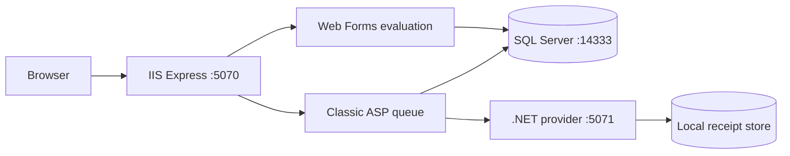

# Triage

Triage is a local, mixed-generation Windows web application that demonstrates safe maintenance of a legacy review workflow: finding incomplete evaluations, enforcing one review per assignment, reassigning work with conflict checks and audit history, and retrying reminder delivery without duplication.

The intentionally defective training snapshot is preserved at the `legacy-baseline` tag. Use the latest `main` branch for the corrected system; the tag exists so the incident, query, and integration fixes can be reproduced rather than merely described.

## What this demonstrates

- Safe, localized change across Classic ASP/VBScript, ASP.NET Web Forms/VB.NET, SQL Server stored procedures, and a small .NET provider.
- Deny-by-default assignment ownership, safe blind-review projections, typed parameters, CSRF protection, and output encoding.
- Deterministic 10,000-abstract seed data and local script-driven verification.
- A realistic baseline-to-release workflow with migration, rollback, performance, and operational evidence.

## Local quick start

This project runs only on loopback and has no hosted deployment. From PowerShell on Windows:

```powershell
.\scripts\Verify-Prerequisites.ps1
.\scripts\Initialize-Triage.ps1
.\scripts\Start-Triage.ps1
.\scripts\Test-Triage.ps1
.\scripts\Stop-Triage.ps1
```

Initialization creates `.local/triage.env` with strong development-only passwords. The file is ignored by Git. Use:

- administrator: `admin@aster-vale.example.test`
- reviewer: `reviewer001@example.test`

Then open `http://127.0.0.1:5070`. The generated password file is named by the start script; passwords are never printed.

Required software is Windows 11, PowerShell 7, IIS Express 10, Visual Studio Build Tools 2022 with Web Build Tools and the .NET Framework 4.8.1 targeting pack, Microsoft OLE DB Driver 19, .NET SDK 10, Docker Desktop with Linux containers, Git, GitHub CLI, and Microsoft Edge. SQL Server 2025 Developer runs in the pinned loopback-only container declared in `docker-compose.yml`.

To deliberately remove the named local SQL volume and generated provider/test data, run `scripts/Reset-LocalDemo.ps1`. It is the only destructive reset path and asks for confirmation.

## Architecture



| Boundary | Technology | Reason it remains |
| --- | --- | --- |
| Operations queue | Classic ASP with VBScript and ADO | Exercises a focused change in an inherited server-rendered boundary. |
| Evaluation workspace | ASP.NET Web Forms with VB.NET on .NET Framework 4.8.1 | Preserves the established page/event model instead of rewriting it. |
| Workflow database | SQL Server 2025 Developer | Owns authorization checks, invariants, transactions, audit history, and set-based queue work. |
| Reminder provider | ASP.NET Core on .NET 10 | Provides one small REST boundary and a separate durable receipt store. |

See [architecture](docs/architecture.md), [requirements](docs/requirements.md), and the [implementation plan](docs/implementation-plan.md) for the trust boundaries and ticket sequence.

## Deliberate scope

Triage has two business pages, two development login pages, one REST endpoint, one main database, and one local provider receipt file. It does not implement abstract submission, registration, real email, multiple review rounds, uploads, payments, cloud deployment, or analytics. Authentication is explicitly development-only. The application uses fictional data and reserved `.test` addresses.

## Baseline warning

The `legacy-baseline` tag intentionally demonstrates three defects for controlled reproduction: review saving uses a racy check-then-insert without a unique assignment invariant; the at-risk queue is correlated and unbounded; and provider receipts are not durable or idempotent. Authorization, parameterization, blind-data projection, CSRF defense, and output encoding are not weakened in that snapshot.
