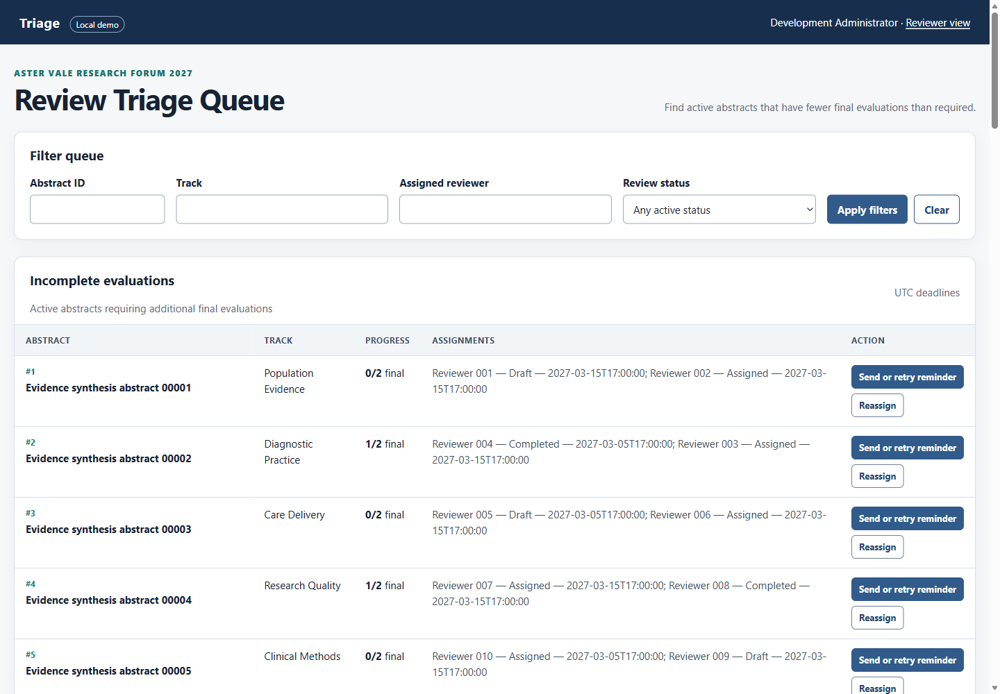
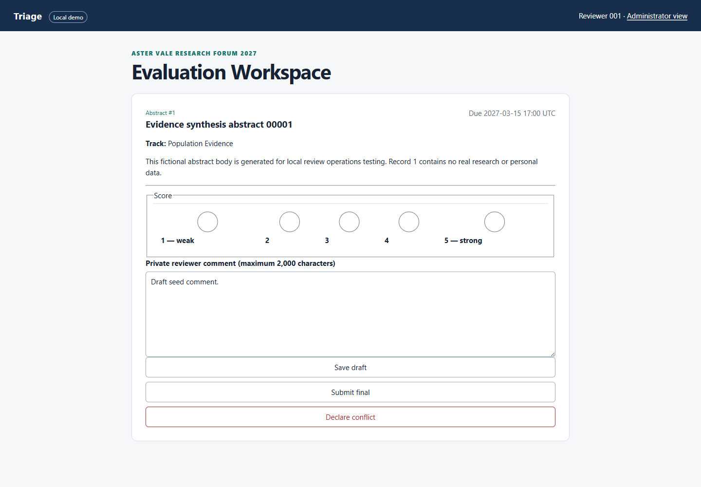
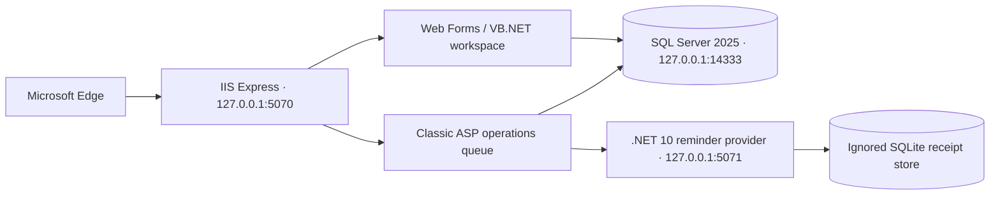

# Triage

Triage is a fully local review-operations module that shows how to improve a mixed-generation Windows application without rewriting it: administrators find incomplete evaluations, safely reassign work, and retry reminders; reviewers score only their own assigned abstracts without seeing private author data.

The corrected application is on `main`. The [`legacy-baseline`](https://github.com/fullstack-nick/Triage/tree/legacy-baseline) tag preserves a deliberately limited starting point so the incident, performance, integration, and release changes can be reproduced rather than merely described.





## What this demonstrates

- Localized maintenance across Classic ASP/VBScript, ASP.NET Web Forms/VB.NET, SQL Server stored procedures, and a small .NET 10 service.
- Database-owned correctness: uniqueness, ownership, conflict exclusion, transactions, idempotency, and audit history do not depend on the UI behaving perfectly.
- Safe handling of uncertain integration outcomes: a timeout after provider commit can be retried with the same identity and payload.
- Evidence-led performance work against deterministic full-scale demo data, including committed actual plans and repeatable before/after measurements.
- A complete local release path: versioned migrations, compatibility rollbacks, backup verification, stored smoke checks, clean reset, real Edge E2E tests, and operational runbooks.

## Problem and scope

The module focuses on two working pages and one integration boundary:

- An administrator queue filters active abstracts with too few final evaluations, pages results in sets of 50, sends or retries a reminder, and reassigns unfinished work while preserving its predecessor.
- A reviewer workspace reads one owned assignment, saves a draft, submits a final score from 1–5, or confirms a conflict.
- A loopback notification provider accepts one durable receipt per idempotency key.

All seeded names, event details, abstracts, and reserved `.test` addresses are fictional. Runtime credentials, provider receipts, generated IIS configuration, logs, process state, and test reports stay under ignored `.local/` storage.

## Architecture



The browser is untrusted. Both web runtimes establish server-side session identity, then stored procedures recheck the administrator actor or reviewer ownership at the data boundary. The reviewer projection omits private author columns entirely. The main database owns a stable assignment/day reminder key; the provider independently commits a payload fingerprint and receipt under that key.

| Boundary | Technology | Why it coexists |
| --- | --- | --- |
| Operations queue | Classic ASP, VBScript, ADO | Demonstrates a focused change inside an inherited server-rendered boundary. |
| Evaluation workspace | ASP.NET Web Forms, VB.NET, .NET Framework 4.8.1 | Preserves the established page lifecycle and event model. |
| Workflow database | SQL Server 2025 Developer, T-SQL procedures | Owns authorization checks, invariants, transactions, set-based work, and audit history. |
| Reminder provider | ASP.NET Core on .NET 10 | Keeps one narrow REST integration separate from both legacy web runtimes. |
| Provider receipts | SQLite via `Microsoft.Data.Sqlite` 10.0.11 | Gives the local mock durable, transactional idempotency across restarts. |
| Browser verification | .NET Playwright 1.62.0 using installed Edge | Exercises the actual mixed web stack without a hosted runner. |

More detail: [architecture and trust boundaries](docs/architecture.md) and [requirements](docs/requirements.md).

## Local quick start

### Prerequisites

Use Windows 11 with PowerShell 7 and at least 8 GB of free workspace disk. The prerequisite gate expects:

- IIS Express 10;
- Visual Studio Build Tools 2022 with Web Build Tools;
- .NET Framework 4.8.1 SDK/targeting pack;
- Microsoft OLE DB Driver 19 (`MSOLEDBSQL19`);
- .NET SDK 10.0.x;
- Docker Desktop using Linux containers;
- Microsoft Edge stable;
- Git and an authenticated GitHub CLI.

SQL Server is pinned in `docker-compose.yml` to SQL Server 2025 CU8 by exact image digest. No globally installed SQL Server or IIS site is required.

### Initialize and run

```powershell
git clone https://github.com/fullstack-nick/Triage.git
cd Triage
./scripts/Verify-Prerequisites.ps1
./scripts/Initialize-Triage.ps1
./scripts/Start-Triage.ps1
```

Open [http://127.0.0.1:5070](http://127.0.0.1:5070). Development usernames are:

- administrator: `admin@aster-vale.example.test`
- reviewer: `reviewer001@example.test`

Initialization generates strong local passwords in `.local/triage.env`; Git ignores the file and the scripts never print the values. `Start-Triage.ps1` refuses to take over occupied application ports.

### Verify and stop

```powershell
./scripts/Smoke-Test.ps1
./scripts/Test-Triage.ps1
./scripts/Stop-Triage.ps1
```

`Test-Triage.ps1` is the single complete gate. It performs locked restore/build, four provider storage tests, direct SQL assertions, 20-way review/reminder races, deterministic failure recovery, a disposable release rehearsal, privacy scans, and two real Microsoft Edge E2E scenarios. If the script starts the applications, it stops only those application processes when it finishes; SQL data remains available.

To deliberately remove and regenerate only the named demo SQL volume plus ignored provider/test state:

```powershell
./scripts/Reset-LocalDemo.ps1
./scripts/Initialize-Triage.ps1
```

The reset is confirmation-gated and is the only workflow that recreates local demo data.

## Demo scenarios

1. Sign in as the administrator to see a 50-row at-risk page from the 10,000-abstract dataset.
2. Filter for abstract `13`; its script-shaped title is displayed as plain text and never executes.
3. Filter for abstract `9991`, then send the same reminder twice; the main database and provider retain one logical identity while recording both attempts.
4. Filter for abstract `9995` to inspect the deterministic reassignment fixture and its preserved history.
5. Sign in as Reviewer 001 to open assignment `1`, save its draft, or choose a score and finalize it.
6. Change the reviewer URL to assignment `2`; foreign and nonexistent assignments produce the same no-content boundary response.

## Database invariants and security decisions

- `Review.AssignmentId` is unique. Surplus legacy rows are copied to `ReviewDuplicateArchive` before deletion and are never silently restored.
- Draft save, finalization, assignment status, and final audit commit together. Identical final replay succeeds; a changed final value is rejected.
- Reviewer read/write procedures require both assignment ID and the server-derived reviewer ID. Private author columns are absent from their result shape.
- Reassignment locks and rechecks administrator role, open state, target activity, conflicts, prior assignment history, and existing children before creating one linked replacement.
- One `NotificationLog` identity exists per assignment and UTC day. One provider receipt exists per idempotency key and canonical payload fingerprint.
- State-changing forms use server session identity and anti-CSRF tokens. Dynamic SQL parameters are typed; rendered untrusted values are context encoded.
- The application SQL login has procedure execution rights and explicit denial of direct table mutation.

The final security gate verifies foreign and missing reads/writes, author projection shape, score bounds, reviewer ViewState/HTML, CSRF rejection for every action, encoded XSS fixtures, security headers, and absence of private sentinels in runtime logs/reports.

## Ticket and pull-request evidence

| Ticket | Problem and solution | Evidence | Pull request |
| --- | --- | --- | --- |
| INC-101 | Duplicate review rows → deterministic quarantine, unique assignment key, atomic idempotent save | [ticket](docs/tickets/INC-101.md), [incident](docs/incident-INC-101.md), SQL + 20-way test | [#1](https://github.com/fullstack-nick/Triage/pull/1) |
| PERF-112 | Correlated unbounded queue → pre-aggregation, bounded paging, justified indexes | [ticket](docs/tickets/PERF-112.md), [performance report](docs/performance-PERF-112.md), actual plans/JSON | [#2](https://github.com/fullstack-nick/Triage/pull/2) |
| FEAT-124 | Destructive or unsafe reassignment → linked predecessor, full eligibility recheck, atomic audit | [ticket](docs/tickets/FEAT-124.md), direct rejection/rollback/race tests | [#3](https://github.com/fullstack-nick/Triage/pull/3) |
| INT-131 | Ambiguous reminder retry → SQL logical key plus durable fingerprinted provider receipt | [ticket](docs/tickets/INT-131.md), xUnit + SQL + HTTP + actual admin retry tests | [#4](https://github.com/fullstack-nick/Triage/pull/4) |
| REL-139 | Unsafe release path → exact-version preflights, paired rollbacks, backup/smoke rehearsal | [ticket](docs/tickets/REL-139.md), disposable 1→6→1→6 verification | [#5](https://github.com/fullstack-nick/Triage/pull/5) |

## Measured queue result

Measurements use the same pinned SQL Server container, deterministic 10,000 abstracts/20,000 baseline assignments, parameters, and first-page checksum before and after.

| Scenario | Baseline | Final |
| --- | ---: | ---: |
| Unfiltered warm median | 205.407 ms | 8.249 ms |
| Unfiltered warm p95 | 225.988 ms | 12.360 ms |
| Unfiltered median logical reads | 205,817 | 1,897 |
| Filtered warm median | 94.563 ms | 12.398 ms |
| Isolated cold maximum | 517.862 ms | 32.819 ms |

The 50-row reference page retained checksum `601941113`. Method, complete statistics, index decisions, and actual XML plans are in the [PERF-112 report](docs/performance-PERF-112.md).

## Migration and rollback model

`SchemaVersion` advances from the tagged baseline at version 1 through final version 6. Every migration requires the exact prior version, uses fail-on-error behavior and transaction boundaries where SQL permits, and records its ledger row only after required objects exist.

There is one paired rollback per release migration. Rollback restores an earlier callable contract where necessary but intentionally keeps quarantine data and integrity indexes; compatibility recovery must not recreate a known defect. `Test-Rel139.ps1` proves baseline upgrade without database recreation, `COPY_ONLY` backup plus `RESTORE VERIFYONLY`, every rollback on a disposable database, preserved invariants, and a second forward upgrade on the same database ID.

See the [local deployment/recovery runbook](docs/deployment-runbook.md) and [release notes](docs/release-notes.md).

## Repository map

```text
database/   baseline schema, deterministic seed, migrations, rollbacks, SQL tests, plans
docs/       architecture, ticket evidence, performance/release notes, runbooks, screenshots
scripts/    prerequisite, initialize/start/stop/reset, smoke, focused and complete tests
src/
  LegacyAdmin/       Classic ASP operations queue
  ReviewerWeb/       Web Forms / VB.NET evaluation workspace
  NotificationApi/   .NET 10 reminder provider and SQLite receipt store
tests/       provider xUnit tests and .NET Playwright Edge E2E tests
```

When a workflow fails, use the [operational runbook](docs/operational-runbook.md). The sanitized [implementation plan](docs/implementation-plan.md) describes the delivery sequence and completion gates.

## Limitations

- Authentication is development-only and passwords come from ignored local configuration.
- The provider accepts local mock receipts; it does not send real email.
- There is one review round and no abstract submission, registration, uploads, payments, or analytics.
- Runtime is loopback-only on one Windows machine; there is no cloud deployment or hosted demo.
- Verification is deliberately local; there is no CI/CD or hosted runner.
